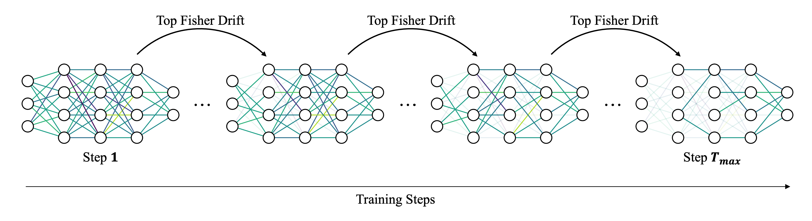

# Fisher-Guided Progressive Parameter Selection for Adaptive Fine-Tuning

**Fisher-guided Adaptive Fine-Tuning (FisherAdapTune)** is a model-agnostic framework for adaptive, parameter-efficient fine-tuning. Instead of selecting trainable parameters from fixed architectural rules, it tracks how each parameter group's Fisher geometry evolves during training and keeps updating only the groups that still show meaningful task-driven drift.

The method uses Jensen-Shannon distance between consecutive Fisher distributions as a scale-invariant signal of adaptation: parameter groups with stabilized Fisher structure are progressively frozen, while groups with continuous curvature shift remain trainable. This turns fine-tuning into a dynamic, task-aware process that reduces unnecessary updates, and improves the efficiency-generalization trade-off without adding inference-time overhead.




Results show that FisherAdapTune recovers the standard transfer-learning hierarchy automatically, freezing generic low-level components earlier while keeping task-dependent modules trainable for longer.

<!-- [](https://arxiv.org/abs/XXXX.XXXXX) -->

---

## Overview

FisherAdapTune wraps any PyTorch model and optimizer with a Fisher-guided freeze loop:

1. **Fisher collection** - diagonal FIM statistics are accumulated via [AdaFisher](https://github.com/AtlasAnalyticsLab/AdaFisher) hooks on `Linear`, `Conv2d`, `BatchNorm2d`, and `LayerNorm` layers.
2. **JS divergence tracking** - Jensen-Shannon distance between consecutive Fisher histograms is computed per parameter chunk. A low, stable JS distance signals that a chunk has stopped learning.
3. **Iterative freezing** — parameter groups whose JS scores fall below an adaptive threshold are masked and frozen. Frozen parameter groups are skipped in forward/backward passes, saving computation in later training stages.


The trainer is fully **plug-and-play**: you can supply the model, optimizer, data loaders, and two callables (`train_step_fn`, `val_step_fn`). No subclassing required. See the [Quick Start](#quick-start) section.

---

## Repository Structure

```
FisherAdapTune/
├── scripts/                  # Core library
│   ├── __init__.py           # Public API
│   ├── adafisher.py          # Diagonal FIM optimizer / Fisher collector
│   ├── fisher_core.py        # Chunking, JS divergence, masking, freezing
│   ├── trainer.py            # FisherAdapTuneTrainer (main user interface)
│   └── utils.py              # EarlyStopping, save_checkpoint, plot_js_history
├── crack_segmentation/       # SAM2 fine-tuning application
│   ├── train_sam2.py
│   ├── config_sam2.yaml
│   └── dataset.py
├── examples/
│   └── minimal_image_classifier.py   # Self-contained runnable example
├── requirements.txt
└── pyproject.toml
```

---

## Installation

```bash
conda create -n fisheradaptune python=3.11 -y
conda activate fisheradaptune
pip install -e .
```

**Dependencies:** `torch >= 2.0`, `numpy >= 1.24`, `pyyaml >= 6.0`

Optional: `wandb` (logging), `matplotlib` (JS-distance plots)

---

## Quick Start

```python
import torch
import torch.nn as nn
from scripts import EarlyStopping, FisherAdapTuneTrainer

# 1. Your model and optimizer
model     = nn.Sequential(nn.Linear(128, 64), nn.ReLU(), nn.Linear(64, 10))
# NOTE: always set weight_decay=0.0 here — FisherAdapTune applies it internally
optimizer = torch.optim.AdamW(model.parameters(), lr=1e-4, weight_decay=0.0)

# 2. Step functions — do NOT call .backward() or optimizer.step() inside
loss_fn = nn.CrossEntropyLoss()

def train_step(model, batch):
    x, y = batch
    return loss_fn(model(x), y)

def val_step(model, batch):
    x, y = batch
    with torch.inference_mode():
        logits = model(x)
    loss = loss_fn(logits, y).item()
    acc  = (logits.argmax(1) == y).float().mean().item()
    return {"loss": loss, "accuracy": acc}

# 3. Trainer
trainer = FisherAdapTuneTrainer(
    model          = model,
    optimizer      = optimizer,
    train_loader   = train_loader,
    train_step_fn  = train_step,
    val_loader     = val_loader,
    val_step_fn    = val_step,
    num_epochs     = 5,
    weight_decay   = 5e-5,
    freeze_interval      = 300,   # steps between freeze decisions
    fisher_ema_interval  = 50,    # steps between Fisher/JS updates
    fisher_slice_blocks  = 4,     # chunks (parameter groups) per weight tensor
)

trainer.fit()
```

See [examples/minimal_image_classifier.py](examples/minimal_image_classifier.py) for a complete runnable example (works with synthetic data — no dataset required).

---

## Real-World Example: SAM2 Crack Segmentation

The [crack_segmentation/](crack_segmentation/) directory contains a full application of FisherAdapTune to fine-tune [SAM2](https://github.com/facebookresearch/segment-anything-2) for binary crack segmentation.

```bash
cd FisherAdapTune
conda activate fisheradaptune
python crack_segmentation/train_sam2.py \
    --config crack_segmentation/config_sam2.yaml \
    --train-data-path /path/to/train \
    --val-data-path   /path/to/val
```

Key CLI flags (all override the yaml):

| Flag | Description |
|---|---|
| `--train-data-path` | Training image/mask root |
| `--val-data-path` | Validation image/mask root |
| `--freeze-interval` | Steps between chunk-freeze passes |
| `--fisher-ema-interval` | Steps between Fisher/JS updates |
| `--js-distance-mode` | `log` (default) or `raw` histogram mode |
| `--disable-wandb` | Skip W&B logging |

---

## Key Hyperparameters

| Parameter | Default | Description |
|---|---|---|
| `fisher_ema_interval` | 300 | How often (steps) to update Fisher/JS stats |
| `freeze_interval` | 3000 | How often (steps) to evaluate and freeze parameter groups |
| `fisher_slice_blocks` | 4 | Number of chunks (parameter groups) per weight tensor |
| `fisher_slice_mode` | `"row"` | Split axis: `"row"` or `"column"` |
| `js_distance_mode` | `"log"` | Histogram normalisation: `"log"` or `"raw"` |
| `chunk_selection_metric` | `"total_variation"` | Chunk ranking: `"total_variation"` or `"mean_js"` |
| `js_variance_lambda` | `1.0` | Freeze threshold = mean + λ × std of JS scores |
| `fisher_ema_decay` | `0.9` | EMA decay for Fisher tensors |
| `prev_js_ema_decay` | `0.9` | EMA decay for the JS-distance signal |

---


## License

This project is licensed under the [Creative Commons Attribution-NonCommercial-ShareAlike 4.0 International License](LICENSE).

You may use, share, and adapt this work for non-commercial purposes with attribution. Derivative works must carry the same license.
